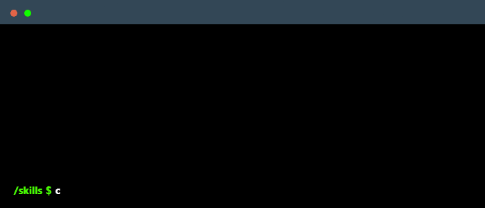

 

<!--
    Your own Terminal GIF can be created here -> https://www.terminalgif.com
-->

    

## Publications

 
  

You can find my publications on Medium, where I share career insights, tips, and my knowledge and experience in tech.

## Connect with me!

    
    
    

## Employer?
> [!IMPORTANT]  
> <a href="https://drive.google.com/file/d/1JHPCcpIRM18dgEWz6MnyR7I7SXwtOvb3/view?usp=drive_link" download>Download my resume</a>

